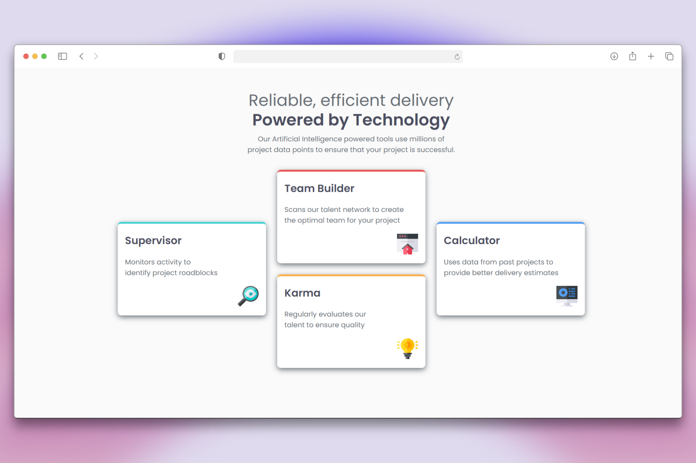
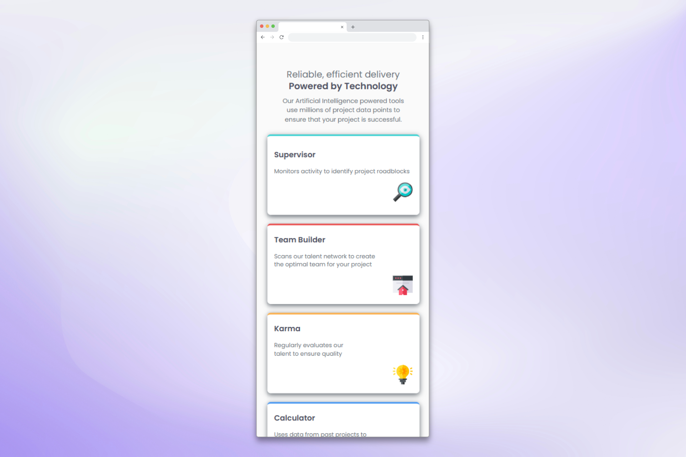

# Four Card Feature Section

A responsive feature section built with CSS Grid and modern web standards, showcasing four key features in an elegant card-based layout optimized for above-the-fold visibility.


## 🎯 Overview

This project is a solution to the [Four Card Feature Section challenge on Frontend Mentor](https://www.frontendmentor.io/challenges/four-card-feature-section-weK1eFYK). The challenge focuses on creating a responsive grid layout that adapts seamlessly across different screen sizes while maintaining optimal user experience with above-the-fold content visibility.

### 📱 Screenshots

| Desktop                                    | Mobile                                   |
| ------------------------------------------ | ---------------------------------------- |
|  |  |

## ✨ Features

- **Above-the-Fold Design**: Complete feature section visible without scrolling for immediate impact
- **Fully Responsive Design**: Optimized for all device sizes from 320px to large screens
- **CSS Grid Layout**: Modern grid system with intelligent column arrangement and adaptive positioning
- **Smart Breakpoints**: Content-driven responsive breakpoints at 1180px, 768px, 480px, and 375px
- **Fluid Typography**: Responsive text scaling using CSS `clamp()` for optimal readability
- **Semantic HTML**: Proper semantic structure for accessibility and SEO
- **Modern CSS**: CSS custom properties, flexbox, and grid with performance optimization
- **Viewport-Optimized**: 100vh layout ensuring perfect fit on any screen

## 🛠 Built With

- **HTML5** - Semantic markup with accessibility features
- **CSS3** - Modern styling techniques including:
  - CSS Grid & Flexbox for layout
  - Custom Properties (CSS Variables) for maintainable code
  - Responsive Media Queries with content-driven breakpoints
  - CSS `clamp()` for fluid typography
  - Viewport units (`100vh`) for above-the-fold optimization
  - Google Fonts (Poppins) for typography

## 📱 Responsive Design Strategy

The layout intelligently adapts across different screen sizes with optimized breakpoints:

- **1180px+**: 3-column asymmetric grid with supervisor and calculator cards spanning multiple rows
- **768px - 1179px**: 2-column grid layout optimized for tablets and small laptops
- **480px - 767px**: Single column layout for mobile devices with increased spacing
- **375px - 479px**: Compact single column optimized for small mobile devices

### 🎯 Above-the-Fold Optimization

The design ensures complete visibility without scrolling:

- **Viewport height utilization**: `min-height: 100vh` with centered content
- **Compact spacing**: Optimized margins and padding for space efficiency
- **Responsive cards**: Adaptive sizing (10rem height, 18rem width on desktop)
- **Fluid typography**: `clamp(1.5rem, 4vw, 2.2rem)` for scalable headings

## 🎨 Design System

### Colors

- **Primary**: Red `hsl(0, 78%, 62%)`, Cyan `hsl(180, 62%, 55%)`, Orange `hsl(34, 97%, 64%)`, Blue `hsl(212, 86%, 64%)`
- **Neutral**: Grey 500 `hsl(234, 12%, 34%)`, Grey 400 `hsl(212, 6%, 44%)`, White `hsl(0, 0%, 100%)`

### Typography

- **Font**: Poppins (200, 400, 600 weights)
- **Base Size**: 15px
- **Fluid Scaling**: Responsive typography using CSS `clamp()`
- **Optimized Hierarchy**: Balanced heading and body text ratios

## 🔍 Technical Highlights

### CSS Grid Mastery

```css
.feature-grid {
  display: grid;
  grid-template-columns: repeat(3, 1fr);
  gap: 1.5rem;
  max-width: 1200px;
}

.feature-supervisor,
.feature-calculator {
  grid-row: 1/3; /* Spanning multiple rows */
}
```

### Viewport Optimization

```css
.features {
  min-height: 100vh;
  display: flex;
  flex-direction: column;
  justify-content: center;
}
```

### Fluid Typography

```css
.features-header h1 {
  font-size: clamp(1.5rem, 4vw, 2.2rem);
}
```

## 📁 Project Structure

```
four-card-feature-section/
├── index.html              # Main HTML file
├── CSS/
│   └── style.css           # Stylesheet with responsive design
├── images/                 # Icons and favicon
│   ├── icon-supervisor.svg
│   ├── icon-team-builder.svg
│   ├── icon-karma.svg
│   ├── icon-calculator.svg
│   └── favicon-32x32.png
├── design/                 # Design reference files
└── README.md
```

## 🚀 Getting Started

1. **Clone the repository**

   ```bash
   git clone https://github.com/Nourhan-Ziada/four-card-feature-section.git
   ```

2. **Navigate to project directory**

   ```bash
   cd four-card-feature-section
   ```

3. **Open in browser**
   ```bash
   # Open index.html in your preferred browser
   # Or use a local server like Live Server in VS Code
   ```

## 💡 Key Learning Points

- **Advanced CSS Grid**: Complex grid layouts with asymmetric positioning and multi-row spanning
- **Above-the-Fold Design**: Viewport optimization for immediate visual impact
- **Content-First Responsive Design**: Breakpoints based on content behavior rather than device sizes
- **Modern CSS Techniques**: CSS custom properties, `clamp()`, viewport units, and flexbox integration
- **Performance Optimization**: Efficient CSS with minimal footprint and fast rendering
- **User Experience Focus**: Design decisions prioritizing immediate content visibility

## 🔧 Development Process

1. **Semantic HTML Structure**: Built with accessibility-first semantic HTML5 markup
2. **Desktop-First Responsive Strategy**: Progressive enhancement with strategic breakpoints
3. **CSS Grid Implementation**: Advanced grid techniques for complex asymmetric layouts
4. **Above-the-Fold Optimization**: Viewport height calculations and content fitting
5. **Cross-Device Testing**: Comprehensive testing across screen sizes from 320px to 4K

## 🤝 Contributing

Contributions, issues, and feature requests are welcome!

## 🙏 Acknowledgments

- Challenge by [Frontend Mentor](https://www.frontendmentor.io)
- Icons provided in the challenge assets
- Built with modern web standards and best practices

---

**⭐ If you found this project helpful, please give it a star!**
